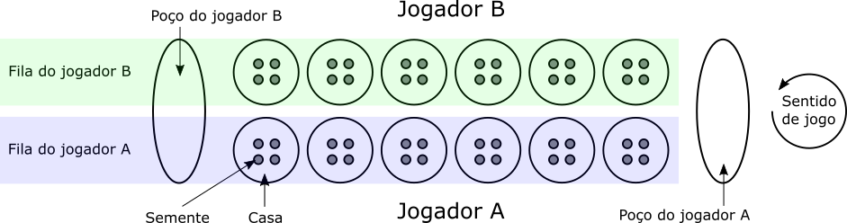
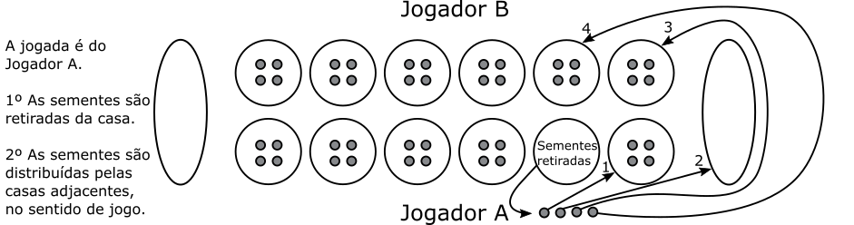
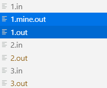
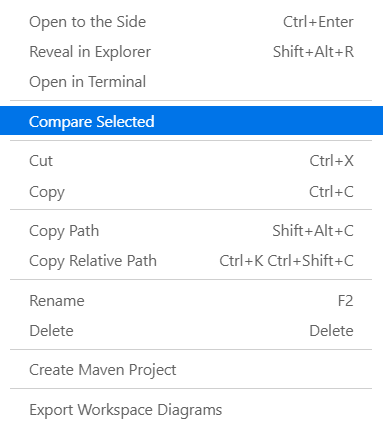
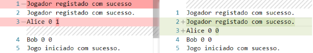

# [Algoritmia e Programação 2021 2022](https://elearning.ual.pt/course/view.php?id=2167) - [UAL](https://autonoma.pt/) <!-- omit in toc -->

## Projeto <!-- omit in toc -->

- [Descrição](#descrição)
  - [Regras](#regras)
  - [Jogo automático](#jogo-automático)
- [Instruções](#instruções)
  - [Registar jogador (RJ)](#registar-jogador-rj)
  - [Listar jogadores (LJ)](#listar-jogadores-lj)
  - [Iniciar jogo (IJ)](#iniciar-jogo-ij)
  - [Iniciar jogo automático (IJA)](#iniciar-jogo-automático-ija)
  - [Detalhes de jogo (DJ)](#detalhes-de-jogo-dj)
  - [Efetuar jogada (J)](#efetuar-jogada-j)
  - [Desistir de jogo (D)](#desistir-de-jogo-d)
  - [Gravar (G)](#gravar-g)
  - [Ler (L)](#ler-l)

## Descrição

*Mancala* corresponde a um tipo de jogo de tabuleiro, para dois jogadores competitivos, onde o objetivo é capturar peças.

Este projeto pretende a implementação de uma versão popular da Mancala.

Nesta versão, o tabuleiro consiste em 12 *casas* dispostas em duas filas. Cada fila pertence a um jogador. No início do jogo, cada casa tem 4 *sementes* (i.e., peças). Nas laterais do tabuleiro existem duas casas grandes denominadas *poços*.

O objetivo geral do jogo é capturar o maior número de sementes no poço, e a mecânica consiste em mover as sementes entre casas e poços, de acordo com um conjunto de regras, no sentido inverso aos ponteiros do relógio.

### Regras

O jogo inicia com 48 sementes, 4 por casa.

Cada jogador efetua uma jogada, à vez. Numa jogada, o jogador seleciona uma casa com sementes na sua fila, retira-as da casa, e deixa-as, uma a uma, nas casas adjacentes da sua fila, no seu próprio poço, e na fila do adversário (excluindo o poço do adversário), no sentido inverso aos ponteiros do relógio.

Regra A
: Se a última semente colocada for no poço, tem direito a uma nova jogada.

Regra B
: Se a última semente colocada for numa casa vazia da própria fila, tem direito a capturar essa semente, e todas as sementes da casa em frente, na fila do adversário. As sementes capturadas são colocadas no poço.

O jogo termina quando, depois de uma jogada, uma das filas fica sem sementes. O jogador que ainda tiver peças na sua fila captura-as para o seu poço. O vencedor é o jogador com mais sementes no poço.

### Jogo automático

Deve ser possível jogar contra o computador. Nesse caso, o jogador humano será o Jogador A, e o Jogador B corresponde a um jogador automático.

Para esse efeito serão considerados dois níveis de dificuldade: Normal, e Avançado.

No nível **Normal**, o jogador automático opta pela seguinte estratégia:

1. Seleciona a casa mais à esquerda possível para espalhar sementes.

No nível **Avançado**, o  jogador automático opta pelos seguintes passos, por ordem:

1. Se possível, seleciona uma casa que permita capturar as peças de uma das casas do oponente (ver Regra B).
2. Se possível, seleciona uma casa que permita terminar no poço, de forma a jogar novamente. Se existirem várias na mesma situação, opta pela mais à esquerda possível (ver Regra A).
3. Seleciona a casa mais à direita possível para espalhar sementes.

O nome do jogador autómatico, para efeitos de listagem de jogadores, é `CPU`.

## Instruções

Na descrição das várias instruções é indicada a sua sintaxe. Os argumentos são separados por espaços em branco, e cada linha é terminada por um caráter fim de linha.

Para cada instrução são indicadas as expressões de saída, quer para execuções com sucesso, quer para insucesso.

No caso de insucesso só deve surgir uma mensagem de erro. Verificando-se várias situações de insucesso em simultâneo, deve surgir apenas a mensagem do primeiro cenário, de acordo com a ordem de saídas de insucesso descritas para cada instrução.

Caso o utilizador introduza uma instrução inválida, ou seja, não prevista na lista de instruções desta secção, ou um número de parâmetros errado para uma instrução existente, o programa deve escrever:

    Instrução inválida.

Pode assumir que não existem erros de representação de informação (e.g., texto em vez de valores numéricos).

A descrição de cada instrução pretende ser exaustiva, sem ambiguidades, e suficiente. Não deve ser possível optar entre vários comportamentos possíveis na mesma situação. Se essa situação ocorrer deve entrar em contacto com equipa docente.

A implementação não deve suportar mais instruções do que as que estão descritas.

O programa termina quando for introduzida uma linha em branco, fora do contexto de uma instrução.

### Registar jogador (RJ)

Regista um novo jogador.

`NomeJogador` é o nome de um jogador.

Entrada:

    RJ NomeJogador

Saída com sucesso:

    Jogador registado com sucesso.

Saída com insucesso:

- Quando já existe um jogador registado com o mesmo nome:

      Jogador existente.

### Listar jogadores (LJ)

Lista os jogadores registados, indicando os registos de jogos jogados. Os jogadores são ordenados por número decrescente  de vitórias, e alfabeticamente para jogadores com o mesmo número de vitórias.

`NomeJogador` é o nome de um jogador. `NumJogos` representa o número de jogos jogados, `NumVitórias` representa o número de vitórias, `NumEmpates` representa o número de empates, e `NumDerrotas` represente o número de derrotas do jogador.

Entrada:

    LJ

Saída com sucesso:

    NomeJogador NumJogos NumVitórias NumEmpates NumDerrotas
    NomeJogador NumJogos NumVitórias NumEmpates NumDerrotas
    ...

Saída com insucesso:

- Quando não existem jogadores registados:

      Sem jogadores registados.

### Iniciar jogo (IJ)

Inicia um novo jogo entre dois jogadores.

`NomeJogadorA` e `NomeJogadorB` são os nomes dos jogadores A e B, respetivamente.

Entrada:

    IJ NomeJogadorA NomeJogadorB

Saída com sucesso:

    Jogo iniciado com sucesso.

Saída com insucesso:

- Quando já existe um jogo em curso:

      Existe um jogo em curso.

- Quando um dos jogadores indicados não se encontra registado:

      Jogador inexistente.

### Iniciar jogo automático (IJA)

Inicia um novo jogo contra um jogador automático.

`NomeJogador` é o nome de um jogador registado, e `Nível` é o nível de dificuldade do jogador automático (ver [descrição](#jogo-automático)).

Entrada:

    IJA NomeJogador Nível

Saída com sucesso:

    Jogo automático de nível Nível iniciado com sucesso.

Saída com insucesso:

- Quando já existe um jogo em curso:

      Existe um jogo em curso.

- Quando o jogador indicado não se encontra registado:

      Jogador inexistente.

### Detalhes de jogo (DJ)

Mostra os detalhes do jogo em curso. No ponto de vista de cada jogador, de frente para o tabuleiro, mostra o número de sementes nas 6 casas correspondentes, iniciando na casa mais à esquerda, e terminando no poço.

`NomeJogadorA` e `NomeJogadorB` são os nomes dos jogadores A e B, respetivamente. `NumSementes` é o número de sementes atualmente numa posição. Casas são apresentadas com parêntesis retos, e poços com parêntesis curvos.

Entrada:

    DJ

Saída com sucesso:

    NomeJogadorA [NumSementes] [NumSementes] [NumSementes] [NumSementes] [NumSementes] [NumSementes] (NumSementes)
    NomeJogadorB [NumSementes] [NumSementes] [NumSementes] [NumSementes] [NumSementes] [NumSementes] (NumSementes)

Saída com insucesso:

- Quando não existe um jogo em curso:

      Não existem jogo em curso.

### Efetuar jogada (J)

Efetua uma jogada, indicando o número da casa correspondente, de acordo com o ponto de vista de cada jogador, de frente para o tabuleiro. A casa mais à esquerda tem identificador 1, e a mais à direita valor 6.

`NomeJogador` é o nome de um jogador. `Posição` é o identificador de uma casa (entre 1 e 6).

`NomeJogadorA` e `NomeJogadorB` são os nomes dos jogadores A e B, respetivamente. `NumSementes` é o número de sementes no poço, após o fim do jogo.

Entrada:

    J NomeJogador Posição

Saída com sucesso:

Nota: Deve surgir apenas uma saída com sucesso, com prioridade indicada pela seguinte ordem de saídas.

- Quando o jogador tem direito a uma nova jogada:

      O jogador NomeJogador tem direito a outra jogada.

- Quando o jogo termina:

      Jogo terminado.
      NomeJogadorA NumSementes
      NomeJogadorB NumSementes

- Quando a jogada termina:

      Jogada efetuada com sucesso.

Saída com insucesso:

- Quando não existe um jogo em curso:

      Não existem jogo em curso.

- Quando o jogador indicado não existe:

      Jogador inexistente.

- Quando o jogador indicado não participa no jogo em curso:

      Jogador não participa no jogo em curso.

### Desistir de jogo (D)

Regista a desistência do jogo por um ou dois jogador. No jogo automático apenas o jogador humano pode desistir. É registada uma derrota para cada jogador que desistiu, ou para ambos, caso os dois desistam. É registada uma vitória para o jogador que não desistiu.

`NomeJogador` representa o nome de um jogador que participa no jogo em curso.

Entrada:

Nota: o segundo `NomeJogador` é opcional.

    D NomeJogador NomeJogador

Saída com sucesso:

    Jogo terminado com sucesso.

Saída com insucesso:

- Quando não existe jogo em curso:

      Não existe jogo em curso.

- Quando um dos nomes indicados não pertence a um jogador registado:

      Jogador inexistente.

- Quando um dos jogadores indicados não participa no jogo em curso:

      Jogador não participa no jogo em curso.

### Gravar (G)

Grava o estado do programa num ficheiro. Deve ser possível continuar o jogo em curso (se existir) após leitura do ficheiro gerado.

`NomeFicheiro` é o nome do ficheiro onde será feita a gravação.

Entrada:

    G NomeFicheiro

Saída com sucesso:

    Jogo gravado com sucesso.

Saída com insucesso: Nenhuma.

### Ler (L)

Recupera o estado do programa de um ficheiro. Deve ser possível continuar o jogo em curso (se existir) após leitura do ficheiro.

`NomeFicheiro` é o nome do ficheiro de onde será feita a leitura.

Entrada:

    L NomeFicheiro

Saída com sucesso:

    Jogo lido com sucesso.

Saída com insucesso:

- Quando o ficheiro indicado não existe:

      Ficheiro inexistente.

mparação também pode ser feita recorrendo a alguns IDEs ou editores de texto, tal como o *Visual Studio Code*. Para tal, abra o diretório do projeto em *File - Open Folder*. Selecione o diretório do projeto confirme em *Select Folder*. Caso não esteja visível, abra o explorador de ficheiros do *Visual Studio Code* em *View - Explorer*.

Selecione os dois ficheiros a comparar (selecione um, e selecione o outro enquanto pressiona na tecla `Ctrl`).

Com os dois ficheiros selecionados, utilize o botão direito do rato em cima da seleção para obter um menu. Escolha *Compare Selected*.

O *Visual Studio Code* apresenta os dois ficheiros com as diferenças a vermelho e verde. Caso não existam diferenças, as linhas dos dois ficheiros surgem sem cores.

